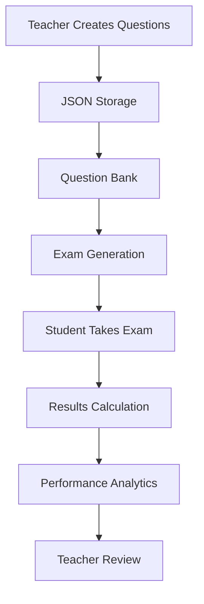

# 🎓 WPF Examination System

A comprehensive, modern examination management system built with **WPF** and **.NET 8**, designed for educational institutions to create, manage, and conduct digital examinations with ease.


## ✨ Features

### 🎯 **Dual Exam System**
- **Practice Exams** - 60-minute sessions for student preparation
- **Final Exams** - 90-minute formal assessments
- Customizable time limits through exam settings

### 📝 **Multiple Question Types**
- **True/False Questions** - Simple binary choice questions
- **Choose One (MCQ)** - Single correct answer from multiple choices
- **Choose All** - Multiple correct answers selection

### 👨‍🏫 **Teacher Dashboard**
- Complete question bank management
- Real-time exam creation and editing
- Question preview with instant validation
- Exam statistics and performance analytics
- Bulk question import/export functionality
- Test exam functionality for quality assurance

### 👨‍🎓 **Student Interface**
- Clean, intuitive exam-taking experience
- Real-time timer display
- Progress tracking throughout the exam
- Instant results display upon completion

### 🔧 **Advanced Management**
- **JSON-based Storage** - Lightweight, portable question storage
- **Automatic Backup** - Exam logs and question versioning
- **Settings Management** - Configurable exam parameters
- **Question Validation** - Ensures question integrity
- **Export Capabilities** - Share question banks between systems

## 📸 Screenshots

### Main Interface
<div align="center">

<p><em>Role selection screen - Choose between Student and Teacher access</em></p>
</div>

### Student Experience
<div align="center">

<p><em>Student dashboard with practice and final exam options</em></p>
</div>

<div align="center">

<p><em>Exam interface with timer, progress tracking, and question navigation</em></p>
</div>

<div align="center">

<p><em>Instant results display with detailed answer review</em></p>
</div>

### Teacher Dashboard
<div align="center">

<p><em>Teacher main menu with exam management options</em></p>
</div>

<div align="center">

<p><em>Comprehensive teacher dashboard for question and exam management</em></p>
</div>

<div align="center">

<p><em>Intuitive question editor with multiple question type support</em></p>
</div>

## 🚀 Quick Start

### Prerequisites
- [.NET 8.0 SDK](https://dotnet.microsoft.com/download/dotnet/8.0) or later
- Windows 10/11 (WPF requirement)
- Visual Studio 2022 or VS Code with C# extension

### Installation

1. **Clone the repository**
   ```bash
   git clone <repository-url>
   cd WPF-Examination-System
   ```

2. **Navigate to the project directory**
   ```bash
   cd Examination.System/ExaminationSys
   ```

3. **Restore dependencies**
   ```bash
   dotnet restore
   ```

4. **Build the application**
   ```bash
   dotnet build
   ```

5. **Run the application**
   ```bash
   dotnet run
   ```

## 📋 Usage Guide

### For Teachers

1. **Launch the Application**
   - Start the application and access the Teacher Dashboard
   - View current question counts and exam settings

2. **Create Questions**
   - Click "Add Question" to open the Question Editor
   - Choose question type (True/False, Choose One, Choose All)
   - Set question content, choices, and correct answers
   - Preview questions before saving

3. **Manage Exams**
   - Configure exam settings (time limits, question pools)
   - Test exams using the "Test Exam" functionality
   - View comprehensive exam statistics

4. **Export/Import**
   - Export question banks as JSON files
   - Share questions between different installations

### For Students

1. **Select Exam Type**
   - Choose between Practice Exam or Final Exam
   - Review exam duration and question count

2. **Take the Exam**
   - Answer questions sequentially
   - Monitor remaining time
   - Review answers before submission

3. **View Results**
   - Instant score calculation
   - Detailed performance breakdown
   - Question-by-question review

## 🏗️ Project Structure

```
WPF.Examination.System/
├── Examination.System/
│   └── ExaminationSys/
│       ├── Models/
│       │   ├── Answer.cs              # Answer entity and JSON converter
│       │   ├── Question.cs            # Question types and base classes
│       │   ├── Exam.cs               # Exam logic and management
│       │   ├── Student.cs            # Student entity
│       │   └── Subject.cs            # Subject management
│       ├── Data/
│       │   ├── QuestionJsonRepository.cs  # JSON storage handler
│       │   └── QuestionFileLoader.cs      # File operations
│       ├── Windows/
│       │   ├── MainWindow.xaml       # Student main interface
│       │   ├── TeacherDashboard.xaml # Teacher management interface
│       │   ├── ExamWindow.xaml       # Exam taking interface
│       │   ├── QuestionEditorWindow.xaml    # Question creation/editing
│       │   ├── ViewQuestionsWindow.xaml     # Question bank viewer
│       │   ├── ExamSettingsWindow.xaml     # Exam configuration
│       │   ├── ExamStatsWindow.xaml        # Statistics viewer
│       │   └── ResultsWindow.xaml          # Results display
│       ├── Data Files/
│       │   ├── practice_questions.json     # Practice question bank
│       │   └── final_questions.json        # Final exam questions
│       └── ExaminationSys.csproj     # Project configuration
└── README.md
```

## 🛠️ Technical Specifications

### Built With
- **Framework**: .NET 8.0
- **UI Framework**: Windows Presentation Foundation (WPF)
- **Language**: C# 12
- **Data Storage**: JSON files
- **Architecture**: MVVM pattern with code-behind
- **Design Patterns**: Repository pattern, Observer pattern

### Key Technologies
- **System.Text.Json** - Modern JSON serialization
- **XAML** - Declarative UI markup
- **Data Binding** - Two-way data synchronization
- **Event-Driven Architecture** - Responsive user interactions
- **Type Discrimination** - Polymorphic JSON handling

## 🔄 Data Flow



## 🤝 Contributing

We welcome contributions! Here's how you can help:

1. **Fork the Project**
2. **Create a Feature Branch** (`git checkout -b feature/AmazingFeature`)
3. **Commit Changes** (`git commit -m 'Add some AmazingFeature'`)
4. **Push to Branch** (`git push origin feature/AmazingFeature`)
5. **Open a Pull Request**

### Development Guidelines
- Follow C# coding conventions
- Include XML documentation for public APIs
- Add unit tests for new features
- Update README for significant changes

## 🐛 Issue Reporting

Found a bug? Have a feature request? 

- **Bug Reports**: Include steps to reproduce, expected vs actual behavior
- **Feature Requests**: Describe the feature and its use case

## 📈 Roadmap

### Upcoming Features
- [ ] **Database Integration** - PostgreSQL/SQL Server support
- [ ] **Web API** - REST API for remote exam management
- [ ] **Advanced Analytics** - ML-powered performance insights
- [ ] **Mobile App** - Cross-platform exam taking
- [ ] **Real-time Monitoring** - Live exam supervision tools
- [ ] **Question Templates** - Reusable question patterns
- [ ] **Bulk Import** - Excel/CSV question import
- [ ] **Plagiarism Detection** - Answer similarity analysis


## 📝 License

This project is open source and available under standard licensing terms.

## 🙏 Acknowledgments

- Built with ❤️ for educational institutions
- Inspired by modern examination needs
- Thanks to the .NET community for excellent documentation
- Special thanks to WPF for enabling rich desktop experiences

## 📞 Support

- **Issues**: Report bugs via GitHub Issues
- **Questions**: Use GitHub Discussions for general questions

---

<div align="center">

**⭐ Star this repository if it helped you!**

Made with 💻 and ☕ by developers, for educators.

</div>
